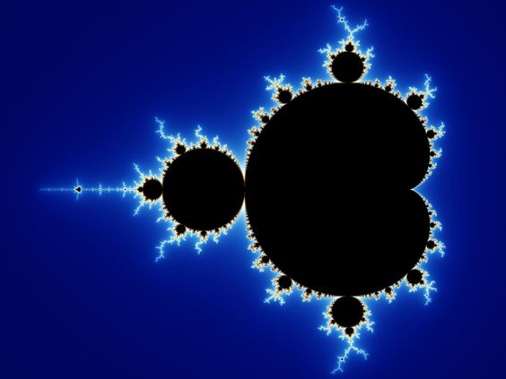
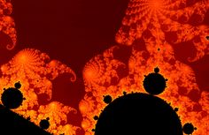

# 42_fract-ol

The Mandelbrot set is a two-dimensional set with a relatively simple definition that exhibits great complexity, especially as it is magnified. It is popular for its aesthetic appeal and fractal structures. The set is defined in the complex plane as the complex numbers \( c \) for which the function

$$
f_c(z) = z^2 + c
$$

does not diverge to infinity when iterated starting at \( z = 0 \), i.e., for which the sequence

$$
f_c(0), \, f_c(f_c(0)), \, \text{etc.}
$$

remains bounded in absolute value.

The term fractal was first used by mathematician Benoit Mandelbrot in 1974. He based
it on the Latin word fractus which means "broken" or "fractured".
A fractal is an abstract mathematical object, like a curve or a surface, which pattern
remains the same at every scale.
Various natural phenomena – like the romanesco cabbage – have some fractal features.

This graphic C project is about transforming the domain of computer pixels into the domain of complex numbers. Once this transformation is well established, the program determines, for each point in the complex space, whether it is part of the Mandelbrot set or not. For each point, based on how many times it was iterated in the Mandelbrot formula, there is a specific color assigned. This difference establishes the beautiful and psychedelic effects that you can see below.

  

 
 

  

## References
### fractol: beautiful fractals using the minilibX in C (mandelbrot and julia set, no bonus)
https://www.youtube.com/watch?v=ANLW1zYbLcs&t=783s

### Fractals are typically not self-similar
https://www.youtube.com/watch?v=gB9n2gHsHN4

### Bernstein Polynomials
http://www.inf.ufsc.br/~aldo.vw/grafica/apostilas/Bernstein-Polynomials.pdf

### Compute color using Bernstein poly
https://www.linkedin.com/pulse/fractal-antonio-ramírez-faura/

### My own Bernstein poly of forth degree made in GeoGebra
https://www.geogebra.org/m/tdqenagj
